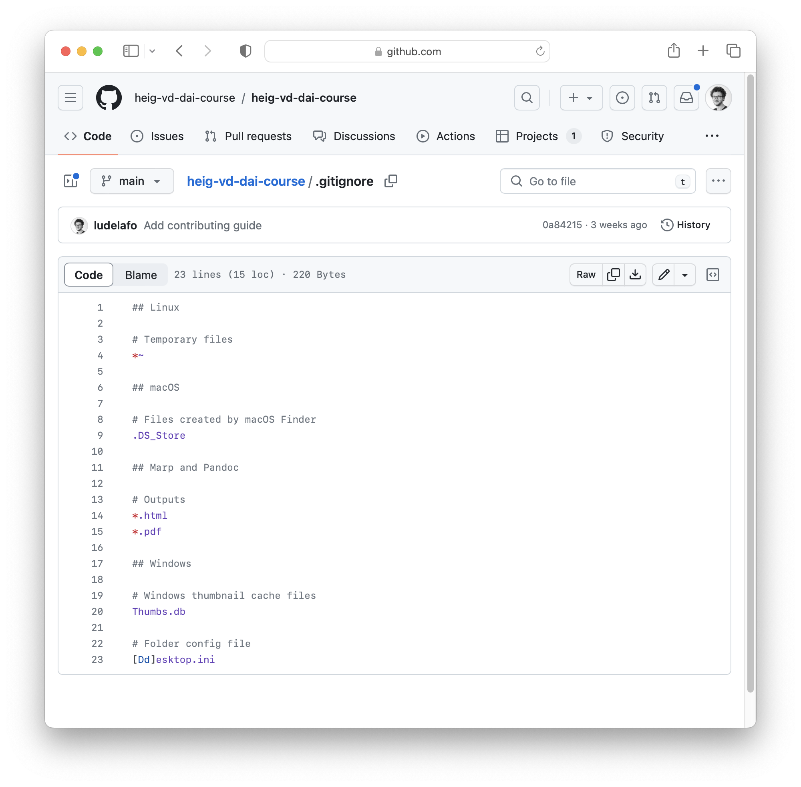
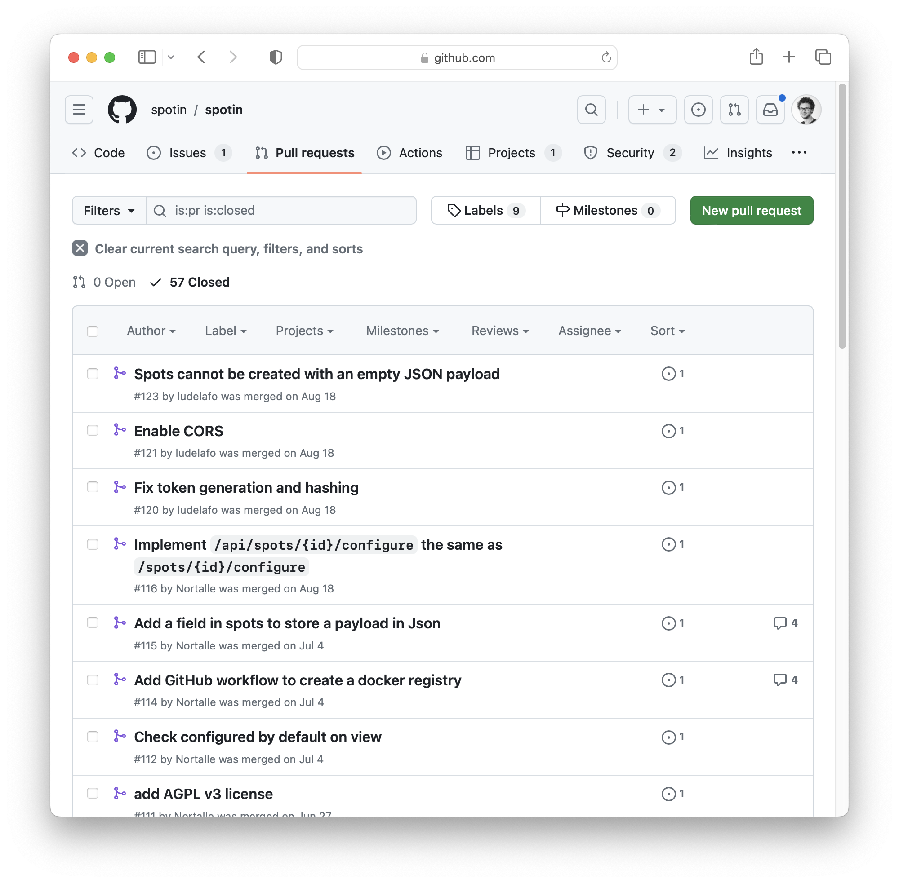
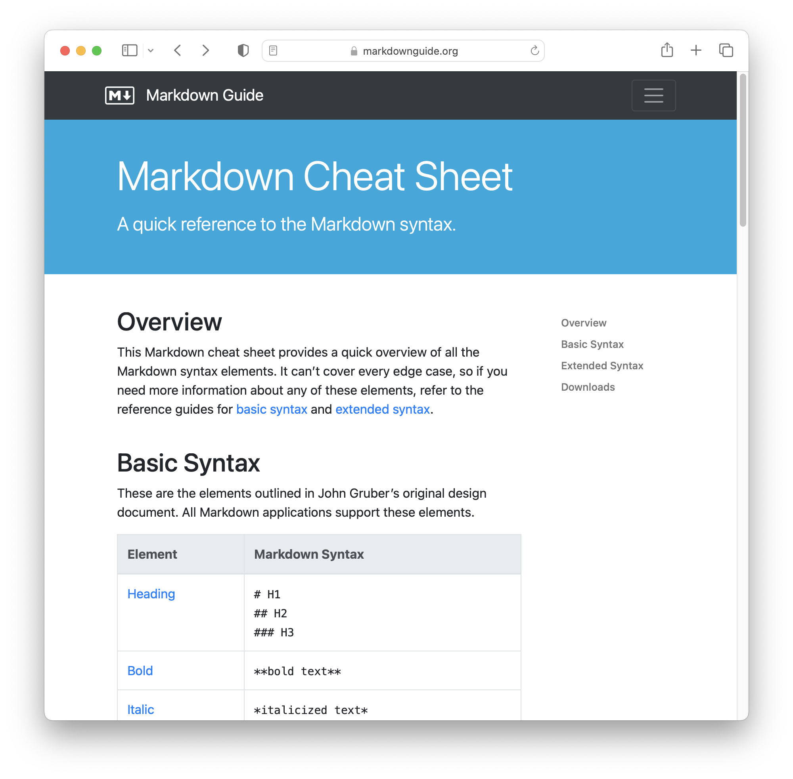
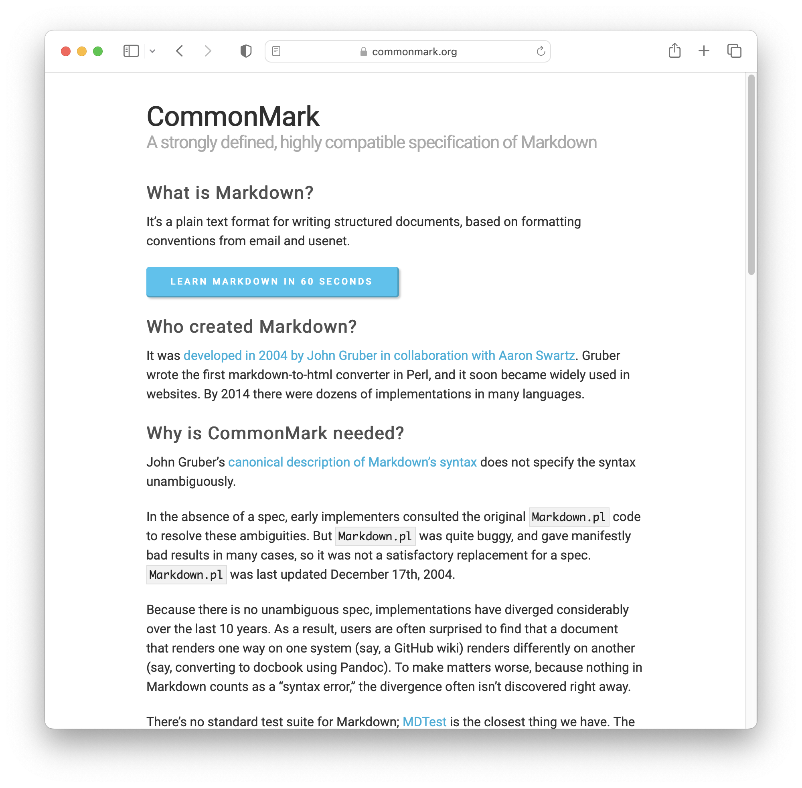

<!--
theme: gaia
size: 16:9
paginate: true
author: L. Delafontaine and H. Louis, with the help of ChatGPT
title: HEIG-VD DAI Course - Git, GitHub and Markdown
description: Git, GitHub and Markdown for the DAI course at HEIG-VD, Switzerland
url: https://heig-vd-dai-course.github.io/heig-vd-dai-course/03-git-github-and-markdown/
footer: '**HEIG-VD** - DAI Course 2023-2024 - CC BY-SA 4.0'
style: |
    :root {
        --color-background: #fff;
        --color-foreground: #333;
        --color-highlight: #f96;
        --color-dimmed: #888;
        --color-headings: #7d8ca3;
    }
    blockquote {
        font-style: italic;
    }
    table {
        width: 100%;
    }
    th:first-child {
        width: 15%;
    }
    h1, h2, h3, h4, h5, h6 {
        color: var(--color-headings);
    }
    h2, h3, h4, h5, h6 {
        font-size: 1.5rem;
    }
    h1 a:link, h2 a:link, h3 a:link, h4 a:link, h5 a:link, h6 a:link {
        text-decoration: none;
    }
    section:not([class=lead]) > p, blockquote {
        text-align: justify;
    }
headingDivider: 4
-->

[web]:
  https://heig-vd-dai-course.github.io/heig-vd-dai-course/03-git-github-and-markdown/
[pdf]:
  https://heig-vd-dai-course.github.io/heig-vd-dai-course/03-git-github-and-markdown/03-git-github-and-markdown-presentation.pdf
[license]:
  https://github.com/heig-vd-dai-course/heig-vd-dai-course/blob/main/LICENSE.md
[discussions]: https://github.com/orgs/heig-vd-dai-course/discussions/2
[illustration]:
  https://images.unsplash.com/photo-1618401471353-b98afee0b2eb?fit=crop&h=720
[course-material]:
  https://github.com/heig-vd-dai-course/heig-vd-dai-course/blob/main/03-git-github-and-markdown/COURSE_MATERIAL.md
[course-material-qr-code]:
  https://quickchart.io/qr?format=png&ecLevel=Q&size=400&margin=1&text=https://github.com/heig-vd-dai-course/heig-vd-dai-course/blob/main/03-git-github-and-markdown/COURSE_MATERIAL.md

# Git, GitHub and Markdown

<!--
_class: lead
_paginate: false
-->

<https://github.com/heig-vd-dai-course>

[Web][web] · [PDF][pdf]

<small>L. Delafontaine and H. Louis, with the help of ChatGPT.</small>

<small>This work is licensed under the [CC BY-SA 4.0][license] license.</small>

![bg opacity:0.1][illustration]

## Objectives

- Understand Git, GitHub, and Markdown
- Develop crucial collaboration skills
- Emphasize the significance of documentation for code usability and project
  visibility

## Git

<!-- _class: lead -->

More details for this section in the
[course material](https://github.com/heig-vd-dai-course/heig-vd-dai-course/blob/main/03-git-github-and-markdown/COURSE_MATERIAL.md#git).
You can find other resources and alternatives as well.

### Git

- A version control system (VCS)
- Created in 2005 by Linus Torvalds
- Efficiently tracks changes in files

### Architecture

- Git operates with a client-server structure
- Repositories (server) and clones (local copies)
- Fully distributed VCS for offline work

### Commits, hashes and tags

- Commits represent snapshots of the repository
- Each commit has a unique, unalterable hash
- Tags serve as references, often for releases
- Commit signing enhances security

### Branches

- Tracks distinct repository versions
- Default branch is typically named `main`
- Branches have names and commit pointers (heads)

### Merging branches

- Collaborative project workflow
- Three primary merging methods:
  - Merge
  - Rebase
  - Squash

### Conflicts

- Arise from simultaneous file edits
- Git detects and requires resolution

### Ignore Files

- `.gitignore` omits specific files
- Improves repository cleanliness
- Avoid gitignore generators

### Summary

- Git is a distributed VCS
- Git uses commits to track changes
- Git uses branches to track different versions of the repository
- Git can pull changes from a branch into another
- Git can merge, rebase or squash branches/commits
- Git can detect and resolve conflicts

We encourage you to learn how to use Git from the command line, so you can still
use it everywhere (even on a server).

## GitHub

<!-- _class: lead -->

More details for this section in the
[course material](https://github.com/heig-vd-dai-course/heig-vd-dai-course/blob/main/03-git-github-and-markdown/COURSE_MATERIAL.md#github).
You can find other resources and alternatives as well.

### GitHub

- Git hosting platform
- Created in 2008
- Web-based Git hosting
- Popular for open source

### Social platform

- Social interactions: follow, star
- Forking repositories

### Free features and PRO features

- Enhanced features with PRO
- Free for students

### Users and organizations

- Users or organizations ownership
- Users can be part of multiple organizations

### Issues, pull requests and forks

- Contribution workflow
  - Issues
  - Forks
  - Pull requests
- Approval process
- Project management tools (wiki, planning, etc.)

### Summary

The whole process would be as follow:

1. Open an issue to discuss the feature (optional, but recommended)
2. Clone or fork the project and checkout to a new branch
3. Make your changes, commit and push them as often as you want
4. Create the pull request
5. The maintainers review and merge if OK
6. You can delete the branch or the fork

## Markdown

<!-- _class: lead -->

More details for this section in the
[course material](https://github.com/heig-vd-dai-course/heig-vd-dai-course/blob/main/03-git-github-and-markdown/COURSE_MATERIAL.md#markdown).
You can find other resources and alternatives as well.

### Markdown

- Lightweight markup language
- Created by John Gruber and Aaron Swartz in 2004
- Simple and versatile

### Markdown and output formats

- Multiple output formats
- Supports HTML integration
- Used in web pages, presentations, documentation

### Syntax

- Markup language with special characters
- Discord and Telegram uses Markdown
- Supports headings, text formatting, code blocks, lists, links, images, and
  tables

### Specifications

- No single standard
- CommonMark and GitHub Flavored Markdown
- Custom extensions for features

### Summary

- Markdown is easy to learn and use
- Markdown can be used to create documentation
- Markdown can be used to create slides
- Markdown can be exported to many formats

## Practical content

<!-- _class: lead -->

### What will you do?

- Install and configure Git
- Create and configure your GitHub account
- Create your own GitHub profile README
- Add yourself to the GitHub organization README

### Find the practical content

<!-- _class: lead -->

You can find the practical content for this chapter on
[GitHub][course-material].

[![bg right w:75%][course-material-qr-code]][course-material]

## Finished? Was it easy? Was it hard?

Can you let us know what was easy and what was difficult for you during this
chapter?

This will help us to improve the course and adapt the content to your needs. If
we notice some difficulties, we will come back to you to help you.

➡️ [GitHub Discussions][discussions]

You can use reactions to express your opinion on a comment!

## What will you do next?

In the next chapter, you will learn the following topics:

- Java: why is Java a popular programming language?
- IntelliJ IDEA: tips and tricks for a better (collaborative) experience
- Maven: Java project structure, dependencies and build tool

## Sources

- Main illustration by [Roman Synkevych](https://unsplash.com/@synkevych) on
  [Unsplash](https://unsplash.com/photos/wX2L8L-fGeA)
- Illustration by [Aline de Nadai](https://unsplash.com/@alinedenadai) on
  [Unsplash](https://unsplash.com/photos/j6brni7fpvs)
- Git logo by [Git](https://git-scm.com/)
- Git illustrations by [Atlassian](https://www.atlassian.com/) -
  [1](https://www.atlassian.com/git/tutorials/what-is-git),
  [2](https://www.atlassian.com/git/tutorials/refs-and-the-reflog),
  [3](https://www.atlassian.com/git/tutorials/comparing-workflows/gitflow-workflow),
  [4](https://www.atlassian.com/git/tutorials/merging-vs-rebasing)
- Git strip by [xkcd](https://xkcd.com/1597/)
- Illustration by [Nathan Dumlao](https://unsplash.com/@nate_dumlao) on
  [Unsplash](https://unsplash.com/photos/KixfBEdyp64)
