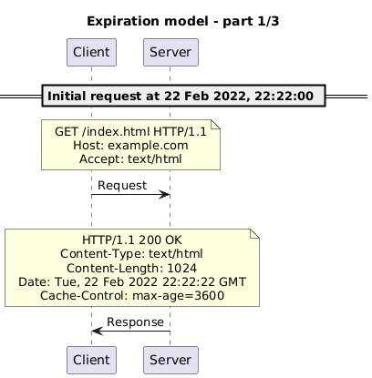
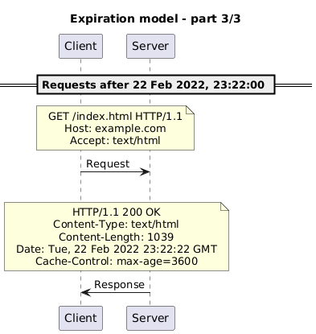
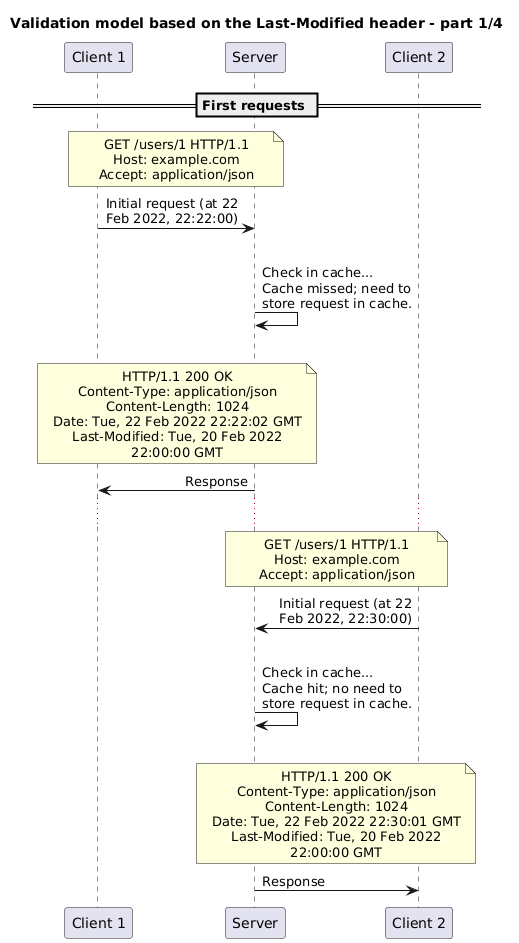
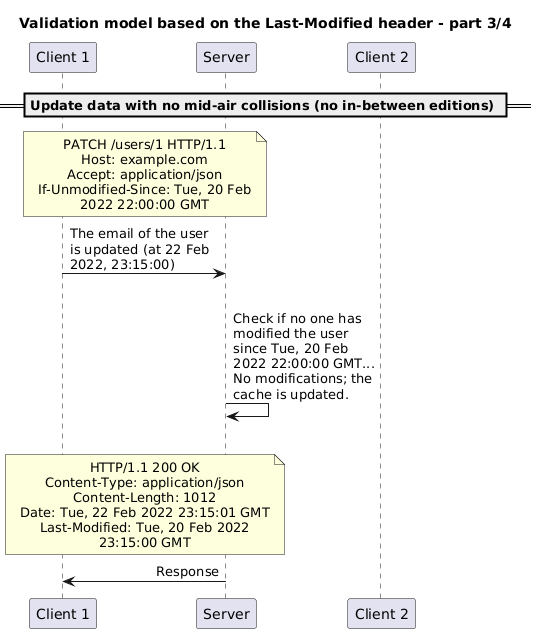
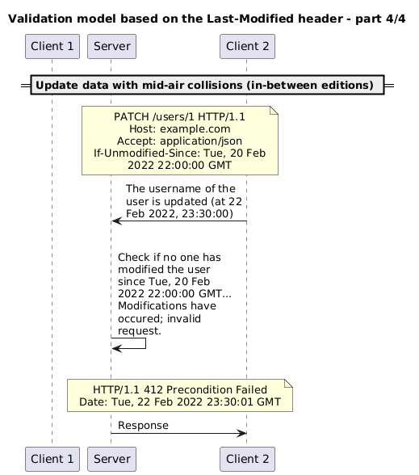
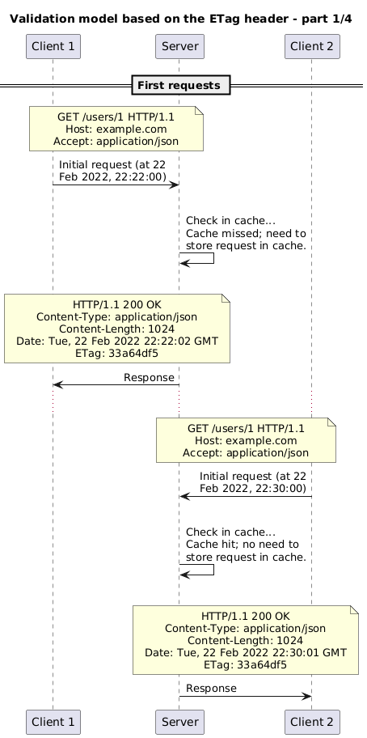
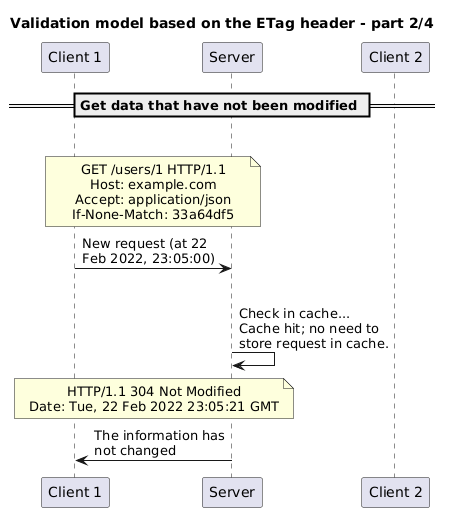
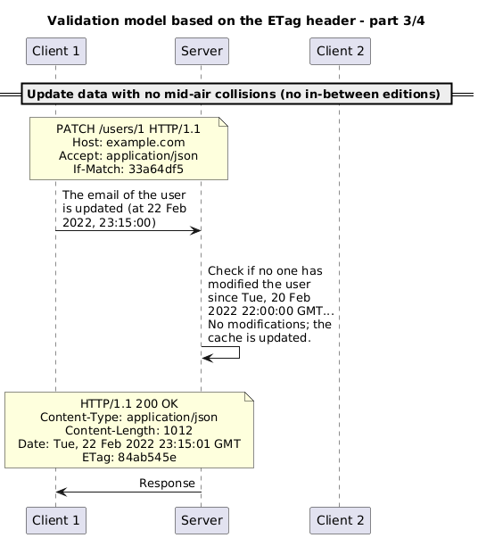

<!--
theme: custom-marp-theme
size: 16:9
paginate: true
author: L. Delafontaine and H. Louis, with the help of GitHub Copilot
title: HEIG-VD DAI - Caching and performance
description: Caching and performance for the DAI course at HEIG-VD, Switzerland
header: '[**Caching and performance**](https://github.com/heig-vd-dai-course/heig-vd-dai-course/tree/main/14.01-caching-and-performance)'
footer: '[**HEIG-VD**](https://heig-vd.ch) - [DAI 2025-2026](https://github.com/heig-vd-dai-course/heig-vd-dai-course) - [CC BY-SA 4.0](https://github.com/heig-vd-dai-course/heig-vd-dai-course/blob/main/LICENSE.md)'
headingDivider: 6
-->

# Caching and performance

<!--
_class: lead
_paginate: false
-->

[Link to the course][course]

<small>L. Delafontaine and H. Louis, with the help of
[GitHub Copilot](https://github.com/features/copilot).</small>

<small>Based on the original course by O. Liechti and J. Ehrensberger.</small>

<small>This work is licensed under the [CC BY-SA 4.0][license] license.</small>

![bg opacity:0.1][illustration]

## Objectives

- Understand the concepts of caching
- Understand how caching can improve performance
- Understand how HTTP features can help to cache data
- Implement caching in a web application

## Caching

<!-- _class: lead -->

More details for this section in the [course material][course]. You can find
other resources and alternatives as well.

### Caching

Process of **storing a copy of a resource to serve it faster**.

Caching can **improve the performance** of a system and **reduce the load** on
the backend.

Caching can be done on the **client-side** or **server-side**.

### Types of caching

- **Client-side caching** (private caches): once a client has received a
  response from a server, it can store the response in a cache. The next time
  the client needs the same resource, it can use the cached response instead of
  sending a new request to the server.
- **Server-side caching** (shared caches): the server stores data in a cache
  with the help of a reverse proxy or by the web application. The next time the
  server needs the same resource, it can use the cached response instead of
  processing the request again.

### CDN

Content Delivery Network (CDN) is a network of servers that are geographically
distributed around the world.

Improve performance by serving static content (images, videos, etc.) from the
closest server.

### Where to cache?

The best would be to cache at each level of the system to ensure the best
performance but it is not always possible or faisable:

- **Client-side**: the cache is stored on the client
- **Server-side**: the cache is stored on the server
- **CDN**: the cache is stored on a CDN

Private caches are caches that are only used by one client. Public caches are
caches that are used by multiple clients.

---

## Managing cache with HTTP

<!-- _class: lead -->

More details for this section in the [course material][course]. You can find
other resources and alternatives as well.

### Managing cache with HTTP

Managing cache is challenging because it is difficult to know when to invalidate
the cache (the data can be stale (= outdated)).

Two main caching models:

- **Expiration model**: the cache is considered valid for a certain amount of
  time
- **Validation model**: the cache is considered valid until the data is modified

#### Expiration model

- The cache is valid for a certain amount of time
- If the cache is not expired, the cache is used
- Uses the `Cache-Control: max-age=<secondes>` header
- The cache is invalidated after the expiration time

---

---

---

#### Validation model

- The cache is valid until the data is modified
- If the cache is not expired, the cache is used
- Two ways to validate the cache:
  - Based on the **`Last-Modified`** header
  - Based on the **`ETag`** header

#### Based on the `Last-Modified` header

- `Last-Modified`: indicates the date and time at which the resource was last
  updated.
- `If-Modified-Since`: returns a `304 Not Modified` if content is unchanged
  since the time specified in this field (= the value of the `Last-Modified`
  header).
- `If-Unmodified-Since`: returns a `412 Precondition Failed` if content has
  changed since the time specified in this field (= the value of the
  `Last-Modified` header) **when you try to update/delete the resource**.

---

---

---

---

#### Based on the `ETag` header

- `ETag`: provides the current entity tag for the selected representation. Think
  of it like a version number or a hash for the given resource.
- `If-None-Match`: returns a `304 Not Modified` if content is unchanged for the
  entity specified (`ETag`) by this field (= the value of the `ETag` header).
- `If-Match`: returns a `412 Precondition Failed` if content is changed for the
  entity specified (`ETag`) by this field (= the value of the `ETag` header)
  **when you try to update/delete the resource**.

---

---

---

---

### Is it possible to use both models?

Yes, it is possible to use the expiration model and the validation model at the
same time:

- No request attempt at all if the cache is not expired
- Validation model when the cache is expired

## Managing cache with proxies

<!-- _class: lead -->

More details for this section in the [course material][course]. You can find
other resources and alternatives as well.

### Managing cache with proxies

Proxies can cache responses to reduce the load on the backend and improve
performance.

Traefik offers a caching middleware in its Enterprise version. Out of reach for
this course.

## Managing cache with key-value stores

<!-- _class: lead -->

More details for this section in the [course material][course]. You can find
other resources and alternatives as well.

### Managing cache with key-value stores

Redis is a popular key-value store that can be used to store cache data.

We will implement this manually in Javalin.

## Questions

<!-- _class: lead -->

Do you have any questions?

## Practical content

<!-- _class: lead -->

### What will you do?

- Implement and validate the validation model based on the `Last-Modified`
  header in your previous web application using curl and a web browser
- This is your last practical content for this course..!

### Now it's your turn!

- Read the course material.
- Do the practical content.
- Ask questions if you have any.

➡️ [Find the course on GitHub][course].

**Do not hesitate to help each other! There's no need to rush!**

![bg right w:75%][course-qr-code]

## Finished? Was it easy? Was it hard?

Can you let us know what was easy and what was difficult for you during this
chapter?

This will help us to improve the course and adapt the content to your needs. If
we notice some difficulties, we will come back to you to help you.

➡️ [GitHub Discussions][discussions]

You can use reactions to express your opinion on a comment!

## Sources

- Main illustration by [Richard Horne](https://unsplash.com/@richardhorne) on
  [Unsplash](https://unsplash.com/photos/black-and-blue-train-running-near-the-tunnel-2PKKbKEkmQE)
- Illustration by [Aline de Nadai](https://unsplash.com/@alinedenadai) on
  [Unsplash](https://unsplash.com/photos/j6brni7fpvs)
- Illustration by [Fermin Rodriguez Penelas](https://unsplash.com/@ferminrp) on
  [Unsplash](https://unsplash.com/photos/silhouette-of-mountain-near-body-of-water-during-daytime-6CQe-WYoPPk)
- Illustration by [Shubham's Web3](https://unsplash.com/@shubzweb3) on
  [Unsplash](https://unsplash.com/photos/an-abstract-background-of-orange-and-white-cubes-km9umcj61Ow)
- Illustration by [Andrik Langfield](https://unsplash.com/@andriklangfield) on
  [Unsplash](https://unsplash.com/photos/pocket-watch-at-355-0rTCXZM7Xfo)
- Illustration by [Karen Grigorean](https://unsplash.com/@karengrigorean) on
  [Unsplash](https://unsplash.com/photos/a-person-pointing-at-a-large-display-of-pictures-9D6UlCW38Ss)

[course]:
	https://github.com/heig-vd-dai-course/heig-vd-dai-course/tree/main/14.01-caching-and-performance
[license]:
	https://github.com/heig-vd-dai-course/heig-vd-dai-course/blob/main/LICENSE.md
[discussions]: https://github.com/orgs/heig-vd-dai-course/discussions/511
[illustration]: ./images/main-illustration.jpg
[course-qr-code]:
	https://quickchart.io/qr?format=png&ecLevel=Q&size=400&margin=1&text=https://github.com/heig-vd-dai-course/heig-vd-dai-course/tree/main/14.01-caching-and-performance
